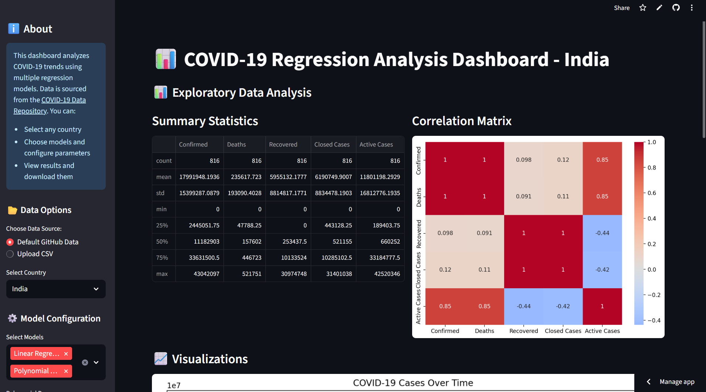

# 📊 COVID-19 Case Prediction Dashboard

An interactive **Streamlit dashboard** coupled with a **Jupyter Notebook** that forecasts COVID-19 case trends using multiple regression techniques.  
This project demonstrates an **end-to-end machine learning workflow**, from data preprocessing to deployment.

---

## 🚀 Live Demo  
🔗 **[View the Interactive Dashboard](https://covid19-regression-prediction-yd5qg3jqdauggv7mykmlno.streamlit.app/)**  
*Runs on Streamlit Cloud — no installation required!*

---

## 📌 Project Overview  
This project predicts COVID-19 confirmed cases using various regression models and provides visual comparisons of their performance.  
Key aspects include:  
- Data preprocessing and feature engineering  
- Training multiple regression models  
- Evaluating model performance using error metrics  
- Deploying ML models via an interactive web app

---

## 🎯 Objectives  
- Forecast **confirmed COVID-19 cases** based on historical data  
- Compare performance of different regression algorithms  
- Visualize trends, growth factors, and predictions interactively  
- Make predictive insights accessible to users worldwide

---

## 📂 Dataset  
- **Source:** [COVID-19 Data Repository](https://github.com/datasets/covid-19)  
- **Key Fields:**  
  - Date  
  - Country/Region  
  - Confirmed Cases  
  - Deaths  
  - Recovered Cases

---

## ⚙️ Features  
- Select country dynamically via sidebar  
- Configure model parameters such as:  
  - Polynomial degree  
  - Ridge regression alpha  
- Visualize:  
  - Total confirmed cases, deaths, and recoveries over time  
  - Growth factors and active vs. closed cases  
  - Model performance metrics in table and bar chart  
- Download prediction results as CSV file

---

## 📊 Sample Model Performance (India)  
| Model                       | MAE          | MSE                    |  
|-----------------------------|--------------|------------------------|  
| Polynomial Regression        | 77,294,775   | 8,068,180,713,630,094  |  
| Polynomial Ridge Regression  | 86,576,701   | 10,138,729,099,548,060 |  
| Bayesian Ridge Regression    | 247,320,826  | 61,303,228,096,201,056 |  
| Linear Regression            | 247,340,631  | 61,313,046,731,319,840 |  

✅ **Best Model:** Polynomial Regression (lowest MAE and MSE)

---

## 🛠️ Tech Stack  
- **Languages:** Python  
- **Libraries:** pandas, numpy, matplotlib, seaborn, scikit-learn, streamlit  
- **Deployment Platform:** Streamlit Cloud  
- **Development Tools:** Jupyter Notebook, Google Colab  

---

## 📦 Installation & Running Locally  
```bash
git clone https://github.com/sarang330/Covid19-regression-prediction.git
cd Covid19-regression-prediction
pip install -r requirements.txt
streamlit run app.py
````

---

## 📁 Repository Structure

```
Covid19-regression-prediction/
├── app.py                           # Streamlit dashboard app
├── requirements.txt                 # Project dependencies
├── Regression_analysis_on_a_COVID_dataset.ipynb  # Jupyter Notebook with analysis
├── README.md                       # Project documentation
├── LICENSE                        # License file


---


## 📷 Screenshots


## 📷 Screenshots




---

## 📜 License

This project is licensed under the MIT License — see the [LICENSE](./LICENSE) file for details.

---

## ✨ Author

Developed by **[Sarang Walke](https://github.com/sarang330)**
If you find this project useful, please ⭐ the repo!

```

---

Ready to commit this `README.md` file to your GitHub repo? Let me know if you want me to help with that too!
```
